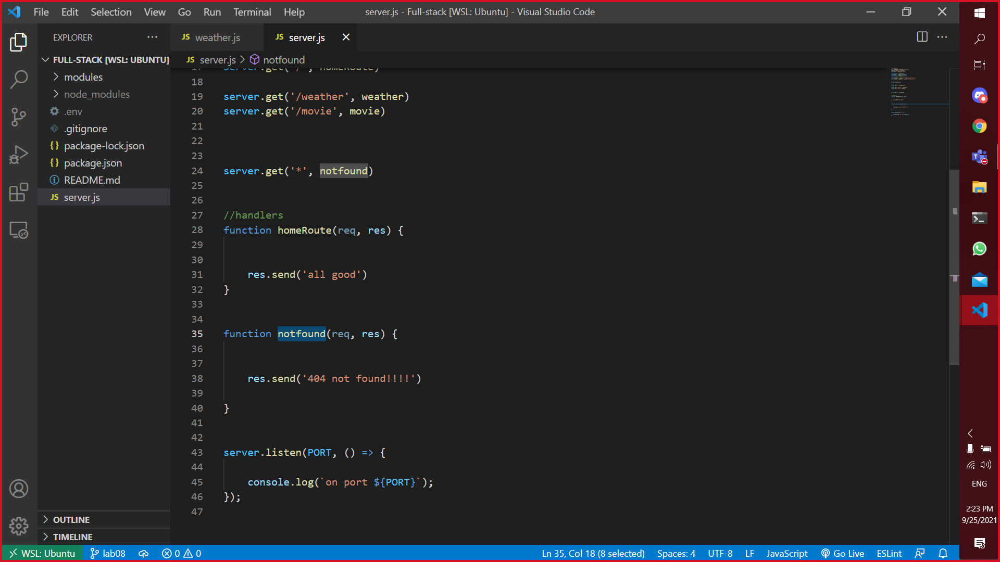
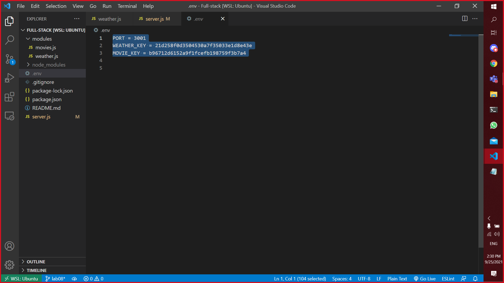
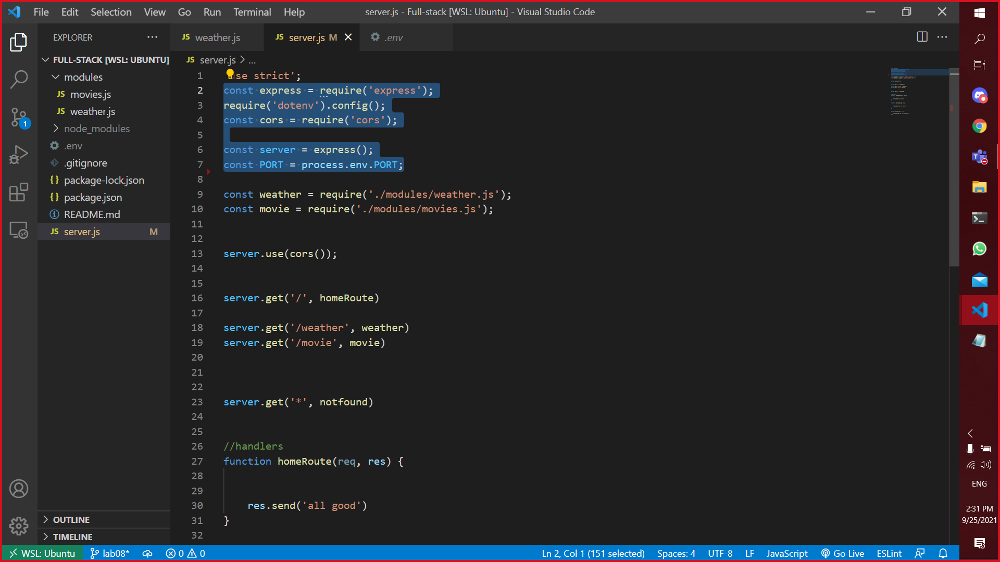
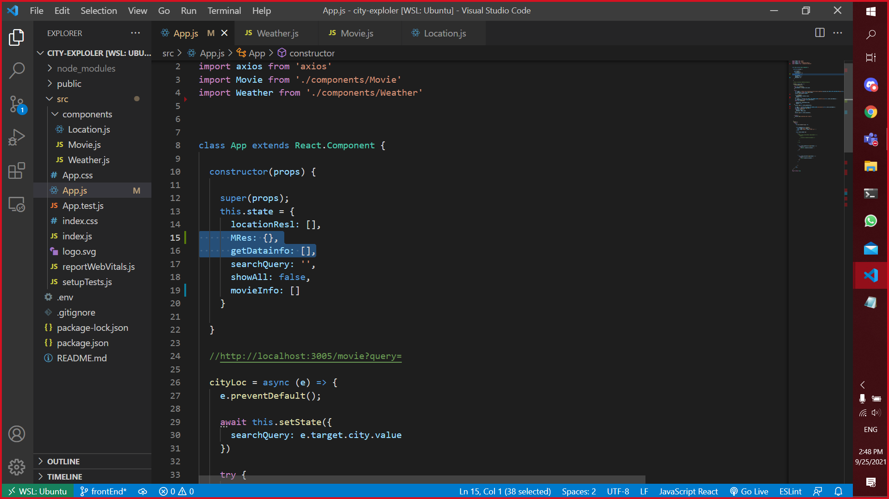
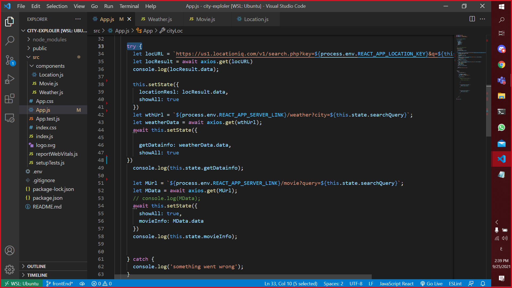

# **white box testing**

**`in this assignment we have to reposotaries one for the back end and the other one for front end`**

 
 

## **first of all let's talk about the** **`Back-End`** **testing**👀
 
 

 

now let's talk about function that we added to handle every route that the user may enter as we can see in the screen-shoot above we **must** declare this function at the end to force the compiler to check all the functions before this one.

**NOTE**`if put it at the top all the routs will return the function value witch is   "404 NOT FOUND!!!!" `
 
 

## **Let's have a look at the this one: 👀**
 
 

 

 this is the most immportant file to be a good programer which is ".env":
 in this file we are putting all data that will not pushed to Github or any other website such as (Keys,port number,etc...)

 **`we have something called gitIgnore this is the library that is responsible to prevent the files like .env to pushed to github or any website`** 

 
 

## **Let's have a look at the this one: 👀**

 
 

  

we should import and install some libraries in order to get the data such as **`Axios`** this one is responsible to get the data from a **`URL`**  and **`cors`** this one if for giving a permtions  to  access this website **`or simply to test the website through a local host`**
 
 

**`NOTE *`** **we test the code in depth but we summarized it for you** 

 
 

## **NOW 🦾🧠 let's talk about the** **`Front-End`** **testing** 
 
 

## **Let's have a look at the this one: 👀**

 
 

  

 
 

**in the screenshoot above when we look at it at the first time it looks `weird`🙄 to mention the `declarations` but we meant this to `proof` that we `MUST` look at the Data that comes from the API to see how should we render it or how to deal with that Data** 
 
 

  

  **To avoid  the App `crashing` we used this methode so we can keep the app `running` even if the user input was `incrroect`🧠  the "try key word" will try the code Dependent on the user input `if the code did't work`❌ will print out to the user that the input was incorrect** ✔

## ** Finally Let's have a look at the this one: 👀**
 
 
  

 
 

**one of the requirement was to add components each one of them `should have all data that related to this component` and as we can see👀 in the screenshot above we have two components one of them for the `WEATHER` and the other one for `MOVIES`**